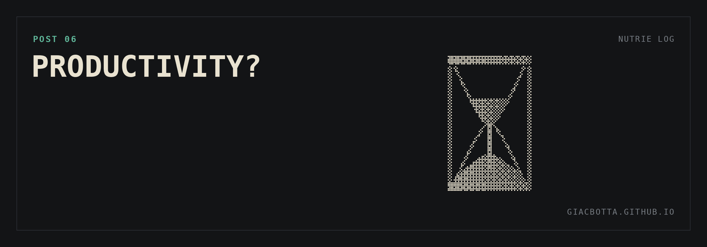

# Post 6 / Productivity?

My hours are half of the success criterion. I am not sure they are going down.
Learning a new technology costs time. At the start, it does not necessarily give
that time back.

Before using AI in such a structured way, I never did more than one thing at a
time. I selected very carefully the few things worth doing. On one side, the
mandatory admin. On the other, the few actions I thought would bring the most value.

**WHAT AI CHANGES**

- It knows a lot, but it does not have my judgment on what matters. It keeps reminding me that certain tasks need doing. It pulls me into them, even when they are not the priority.
- It makes me think I can do more. Opening several fronts at once, in a business where my time is very limited, can become a distraction.
- It steers my attention toward what AI can handle. Many fronts, little time: I shift from picking the highest value task to picking the one AI can manage.

**LEARNINGS**

- I get many more things done. That part is not in doubt.
- I spend more time on it. Also without a doubt.
- Am I spending it in the most productive way? I do not have an answer yet.
