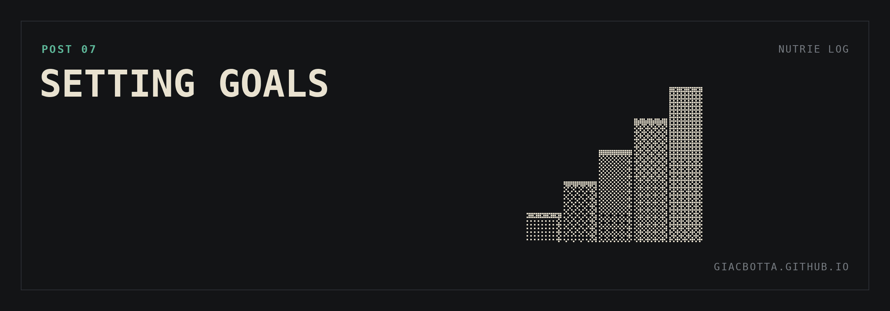

# Post 7 / Setting goals

For the first weeks I let the brain run on its own, a bit blind. It asked for
information and pointed at what could improve. That is how I ended up doing more,
without knowing if it was what mattered most. Now it gets goals.

I defined them with the brain, in a conversation about the business.

**WHY GOALS**

- Focus it on what matters. I want it to get better at picking the most important tasks for me.
- Test its limits.

**THE SCALE, FROM EASIEST TO HARDEST**

1. Automating operations and reporting.
2. SEO.
3. Ads.
4. Adding new self-service activities inside the existing sites, for new revenue.
5. Opening new luggage storage sites.

**WHAT I EXPECT**

- Automation & SEO: it will help a lot.
- Ads: I have no idea how much it can move.
- Expansion: if it only helps find places and opportunities, that is already an upgrade.

The harder the goal, the less sure I am that it can deliver. And the more it is worth if it does.
