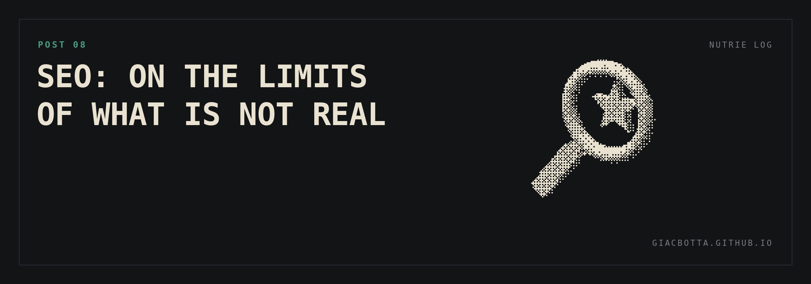

# Post 8 / SEO: on the limits of what is not real

SEO was the second goal on the scale. It often feels like a mystical discipline:
people believe success comes down to an expert's dirty tricks. I had AI research
what actually moves the needle for a business like mine. The conclusion was much
more grounded: real feedback from actual customers matters most.

**WHAT ELSE THE RESEARCH FOUND**

- Clear opportunities to improve the website.
- Complex keywords that do not rank well right now, especially in other languages.

**WHAT AI DID**

Every task below was done by AI, quickly and mostly automated.

- Added translations to the website, which was English only.
- Started posting regularly on the Google Business Profile.
- Listed the business in more online service directories, with accurate and consistent information, to help Google rank it higher.

**LEARNINGS**

- The feedback lever has a limit. Beyond small tweaks to response rates, I cannot move it much further.

The real test for the coming months: whether all the small tweaks create a measurable business impact, or AI matters less on this goal than I expected.
