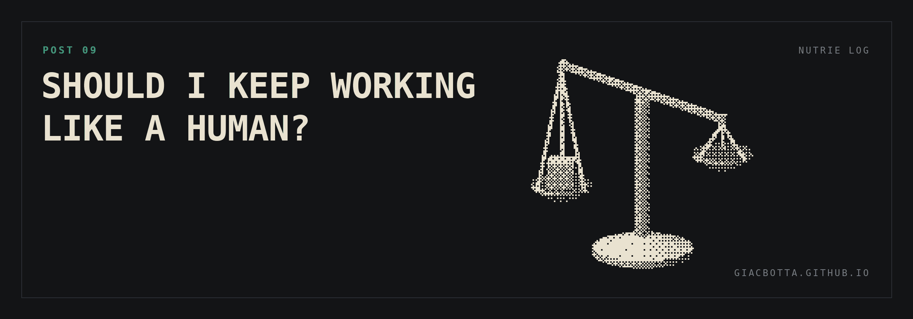

# Post 9 / Should I keep working like a human?

Changing one thing on the website put the experiment in front of a classic trade
off. I can work the AI way, which is far more efficient or I can work the human
way, which keeps me in control but costs more time and more tokens.

**HOW IT STARTED**

- The SEO research found that the site rebuild had dropped a set of keywords, most of them in foreign languages.
- On Squarespace the standard fix is an extension. Weglot, the language plugin, costs 150 euro a year for a few pages in a second language.
- That is 62.5% of Claude's costs. Removing one plugin pays back most of Claude investment. Plus it allows me more languages and pages.
- AI can build and maintain the extra language pages. Maintenance is the delicate part, and the real cost of running multiple pages.

**THE WAYS TO DO IT**

- Moving and copying blocks in the browser. Slower, more tokens, but it leaves a structure I can edit myself.
- Code injection. Faster, fewer tokens, cleaner to maintain. But I'm no developer: the site stops being something I can touch.
- Even more radical: I could abandon Squarespace completely.

Handing the whole site to code injection scares me. The day AI is not available, I am left with a site I cannot fix quickly.

**WHERE I LANDED**

- Control, for now. I keep the browser route and a structure I understand.
- Cost: down. I avoid an extension I do not need.
- Time: down, but only partially. It would drop much further if I gave the site entirely to AI.
- The language pages are a long term bet. Nothing to show for them this month.

This is one small website and one person deciding.
Inside a bigger company, the same trade off could mean a massive restructuring.
