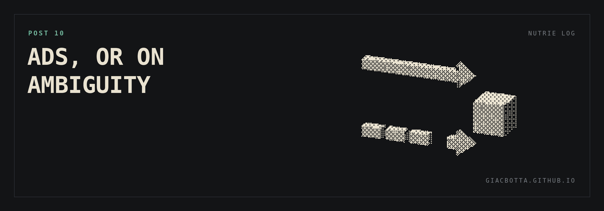

# Post 10 / Ads, or on ambiguity

Ads were the third goal on the scale. Performance marketing on a local business
has one structural problem, and it does not get easier because the business is
small: attribution. Customers can book online or walk into the deposit and pay on
the spot. So no Google Maps metric predicts sales, and no website metric does
either. Anyone can find the location on the site and then pay in person instead
of booking.

**WHAT THAT MEANS IN PRACTICE**

- Online booking signals are almost always ambiguous.
- Only a small share of our customers ever passes through an online booking.
- The closest proxy we have is a site visit that shows intent. A click on something, not a page view.

**WHAT I ASKED**

I gave Claude every path a customer can take to buy from us. Then I asked it to set the Ads goal from first principles, based on how people actually buy. Not the answer I already had in my head, but what to set, what to optimize, what counts as a conversion.

**WHAT I GOT**

- The obvious answer: track online purchases. That ignores most of the funnel and does not work.
- Then nothing. It kept handing the decision back to me, even when I pushed it to commit.
- On an ambiguous problem it did not make a call.

**WHAT CHANGES**

- Nothing in how I run Ads. I keep optimizing the way I did before.
- Claude still helps once the goals are set. It just did not set them.

Seems like I can't trust him to decide under ambiguity... or maybe I just don't know how to prompt.
