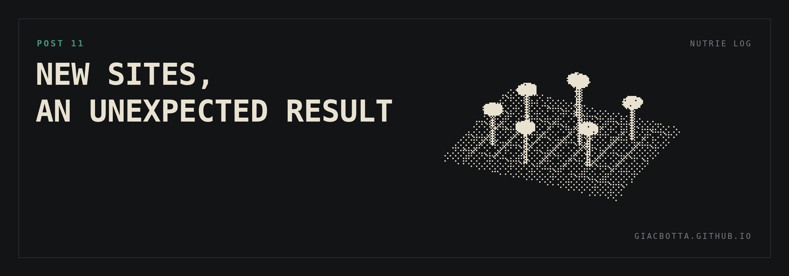

# Post 11 / New sites, an unexpected result

Opening new locations sat last on the goal scale. The hardest, and the one I
expected the least from. It is the goal where AI has surprised me most. We are
looking in two directions: more luggage storage sites, and other self service
businesses built on the same logic.

**WHAT I EXPECTED**

- That research at this depth would burn a huge number of tokens.
- At best get a one off decent research, but not possible to make it repetitive on budget.

**WHAT ACTUALLY WORKS**

Not conversations. [Python scripts that read public sources](https://github.com/Giacbotta/nutrie-new-business-tracking), and keep reading them.

- [Average occupancy of luggage deposits in a given area](https://claude.ai/artifact/Eirj2AhdanFqMg72Co9wRS). Running this every day on marketplace websites, I will have a pretty complete view soon.
- New listings for commercial premises.
- New public tenders.
- Resellers and third parties worth approaching.

Simple to write, cheap to run (directly on GitHub), and they do not need me in the loop.

**WHY IT MATTERS**

- Before, I picked an area from intuition, then ran a few manual searches to confirm the intuition.
- Now I can map the opportunities and pick the next move from data.

I am still at the test stage. No site has been chosen this way yet.

The value is not that it runs analysis I couldn't run before, and it does it all the time, so I don't miss any chance.
