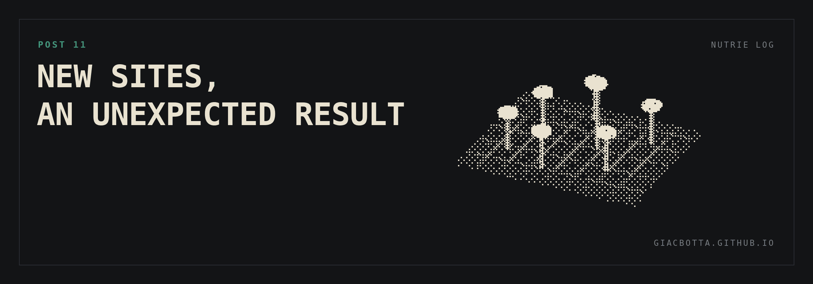

# Post 11 / New sites, an unexpected result

Opening new locations sat last on the goal scale. The hardest, and the one I
expected the least from. It is the goal where AI has moved me furthest. I am
looking in two directions: more luggage storage sites, and other self service
businesses built on the same logic.

**WHAT I EXPECTED**

- That research at this depth would burn a huge number of tokens.
- At best a one off decent research, impossible to repeat on budget.

**WHAT ACTUALLY WORKS**

Not conversations. [Python scripts that read public sources](https://github.com/Giacbotta/nutrie-new-business-tracking), and keep reading them.

- [Average occupancy of luggage deposits in a given area](https://claude.ai/artifact/Eirj2AhdanFqMg72Co9wRS). It runs every day on marketplace websites. I already have a pretty complete view. Seasonality is still missing.
- New listings for commercial premises.
- New public tenders.
- Resellers and third parties worth approaching.

Simple to write, cheap to run (directly on GitHub), and they do not need me in the loop.

**WHY IT MATTERS**

- Before, I picked an area from intuition, then ran a few manual searches to confirm it.
- Now I have analytics on a level I could never have built alone.
- That lets me invest with much more confidence in places I would have judged too risky.

In two weeks I identified a site. I never expected that kind of certainty at this speed. I could close on it soon.
